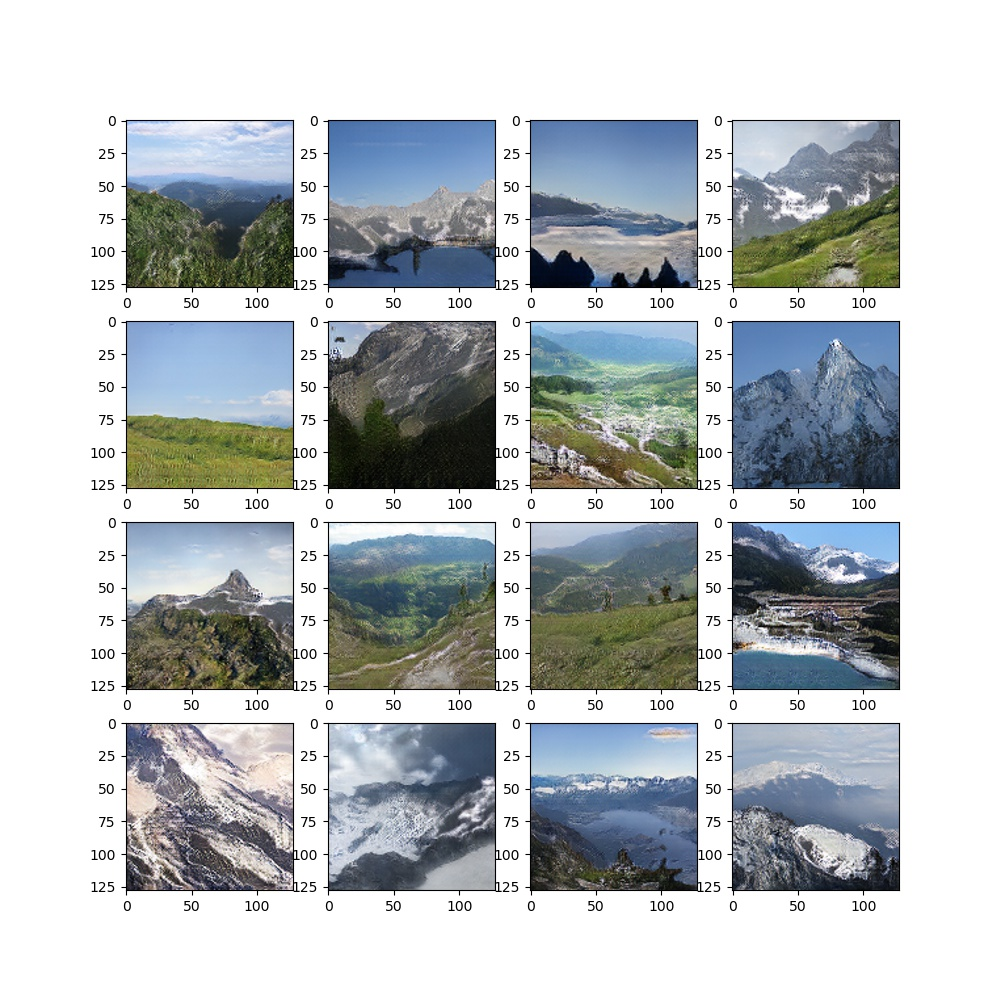

# Self-Attention-Gan
Pytorch implementation of `"Self-Attention Gan"` based on [Self-Attention Generative Adversarial Networks](https://arxiv.org/pdf/1805.08318.pdf)

`THIS IS STILL IN PROGRESS, NOT READY TO CLONE`

This is an attempt to build a SaGan, basically a Gan using Spectral Norm and Attention Layers in both the discriminator and generator.

What I've uploaded here differs a bit from the paper, this version has no residual blocks, and uses deconvolutions and stride 2 convolutions instead of up-sample and down-sample blocks. I might make another version in the future which matches closer to the paper.

I've tested this using the [GeoPose3k Dataset](http://cphoto.fit.vutbr.cz/geoPose3K/).

# Code Usage
Usage instructions found here: [user manual page](USAGE.md).

## Example Output
### GeoPose3k Dataset

