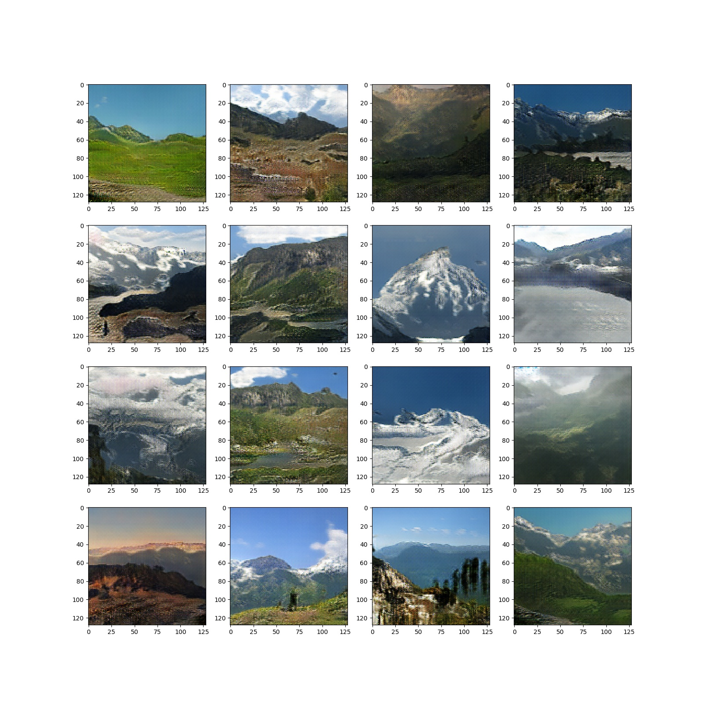

# self-attention-gan
Pytorch implementation of Self Attention Gan based on [Self-Attention Generative Adversarial Networks](https://arxiv.org/pdf/1805.08318.pdf)

`THIS IS STILL IN PROGRESS, BUILDING UP THE MODEL SLOWLY TO GET AN UNDERSTANDING OF THE PAPER`
This is an attempt to build a SaGan, a Gan which used spectral norm and attention layers in both the discriminator and generator.

I've tested this using the [GeoPose3k Dataset](http://cphoto.fit.vutbr.cz/geoPose3K/).

# Code usage
Usage instructions found here: [user manual page](USAGE.md).

## Example Output
### GeoPose3k Dataset

