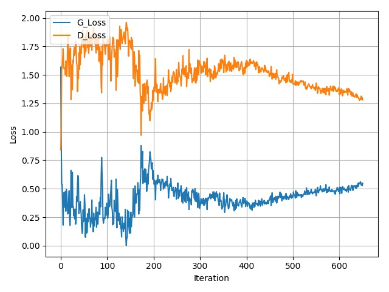

## Getting Started
- Install `pytorch 0.4.1` and dependencies from https://pytorch.org/
- Install packages 'tqdm', 'matplotlib', 'unzip', 'tar', 'cv2'

- Clone this repo:
```bash
git clone https://github.com/NeuralVFX/self-attention-gan.git
cd self-attention-gan
```

- Download the image dataset [GeoPose3K](http://cphoto.fit.vutbr.cz/geoPose3K/):

```bash
bash data/get_test_dataset.sh
```

## Train The Model
```bash
python train.py --res 128 --train_epoch 5000 --save_root austria
```

## Continue Training Existing Saved State
```bash
python train.py --load_state output/austria_3.json --res 128 --train_epoch 5000 --save_root austria
```

## Command Line Arguments

```
--z_size', default=128, type=int                        # Size of input to generator
--disc_max_filts', default=512, type=int                # Max filter count for discrimintor
--disc_min_filts', default=128, type=int                # Min filter count for discrimintor
--gen_stretch_z_filts', default=1024, type=int          # Filter count in first conv layer after input in generator
--gen_max_filts', default=512, type=int                 # Max filter count for generator
--gen_min_filts, default=128, type=int                  # Min filter count for generator
--attention', default=True, type=bool                   # Use attention in models
--disc_layers', default=3, type=int                     # Count of conv layers in discriminator
--lr_disc', default=.0004, type=float                   # Learning rate for discriminator
--lr_gen', default=.0001, type=float                    # Learning rate for generator
--res', default=128, type=int                           # Image size for both generator and dataloader
--train_epoch', default=600000, type=int                # Number loops trough training set
--save_every', default=10, type=int                     # How many epochs to train between every save
--save_img_every', default=1, type=int                  # How many epochs to train between every preview image
--workers', default=16, type=int                        # How many workers the data loader should use
--data_perc', default=1, type=float                     # Percentage of dataset to use, selected with fixed random seed
--dataset', default='geoPose3K_final_publish', type=str # Folder name where dataset can be found
--batch_size', default=8, type=int                      # Batch size for training data
--batch_size', default=8, type=int                      # Batch size for training data
--save_root', default='austrian', type=str              # Prefix for files created by the model under the /output directory
--load_state', type=str                                 # Optional: filename of state to load and resume training from


```

## Data Folder Structure

- This is the folder layout that the data is expected to be in:

`data/<data set>/`

## Output Folder Structure

- `weights`, `test images`, and `loss graph`, are all output to this directory: `output/<save_root>_*.*`

- Loss Graph Example: `output/austria_loss_a.jpg`


- Test Image Example (output every loop through dataset): `output/austria_649.jpg`


## Other Notes

- Currently the data loader works very specifically with the `GeoPose3k` dataset
