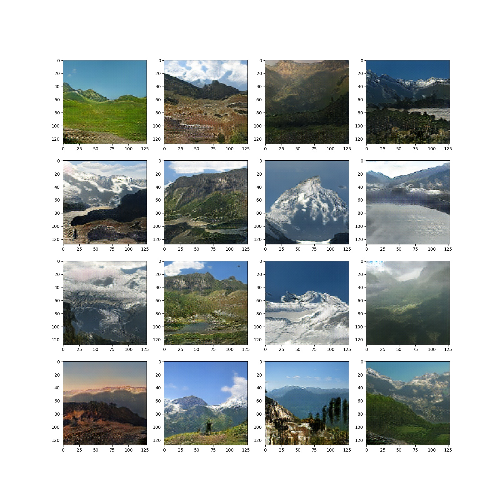

## Getting Started
- Install `pytorch 0.4.1` and dependencies from https://pytorch.org/
- Install packages 'tqdm', 'matplotlib', 'unzip', 'tar', 'cv2'

- Clone this repo:
```bash
git clone https://github.com/NeuralVFX/self-attention-gan.git
cd self-attention-gan
```

- Download the image dataset [GeoPose3K](http://cphoto.fit.vutbr.cz/geoPose3K/):

```bash
bash data/get_test_dataset.sh
```

## Train The Model
```bash
python train.py --res 128 --train_epoch 5000 --save_root austria
```

## Continue Training Existing Saved State
```bash
python train.py --load_state output/austria_3.json --res 128 --train_epoch 5000 --save_root austria
```

## Command Line Arguments

```
--obj_file', default='/geo/grid_256.obj', type=str      # Obj file  - must be a square grid
--dem_file, default='/dem/USGS_NED_one_meter_x34y441_CO_Central_Western_2016_IMG_2018.img',
                                    type=str            # Train folder name
--disc_layers', default=3, type=int                     # Count of conv layers in discriminator
--disc_filters', default=512, type=int                  # Filter count for discrimintors
--lr_disc', default=.001, type=float                    # Learning rate for discriminator
--lr_mesh', default=.001, type=float                    # Learning rate for texture on mesh
--render_res', default=256, type=int                    # Image size for both Neural Render and Dataloader
--train_epoch', default=6, type=int                     # Number lookps trough training set
--save_every', default=1, type=int                      # How many epochs to train between every save
--load_workers', default=1, type=int                    # How many workers the data loader should use
--data_perc', default=1, type=float                     # Percentage of dataset to use, selected with fixed random seed
--save_root', default='lsun_test', type=str             # Prefix for files created by the model under the /output directory
--load_state', type=str                                 # Optional: filename of state to load and resume training from
```

## Data Folder Structure

- This is the folder layout that the data is expected to be in:

`data/<data set>/`

## Output Folder Structure

- `weights`, `test images`, and `loss graph`, are all output to this directory: `output/<save_root>_*.*`

- Loss Graph Example: `output/austria_loss_a.jpg`


- Test Image Example (output every loop through dataset): `output/austria_649.jpg`


## Other Notes

- Currently the data loader works very specifically with the `GeoPose3k` dataset
